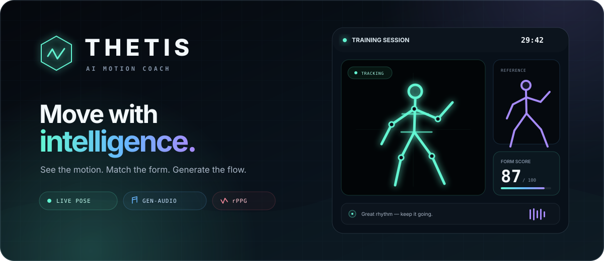
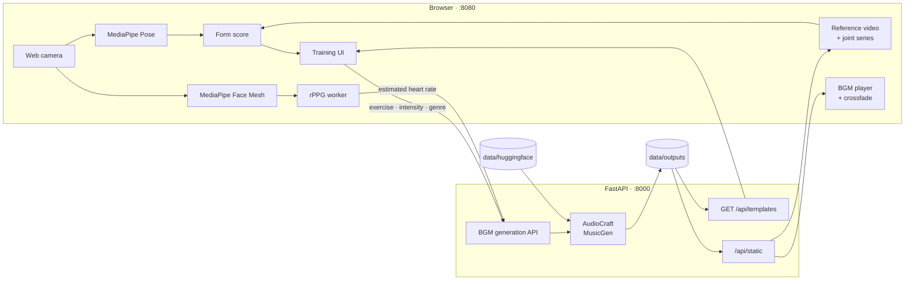

<p align="center">
  
</p>

<h1 align="center">THETIS</h1>

<p align="center">
  <strong>動きを見る。フォームを合わせる。音で、続けたくなる。</strong><br>
  Webカメラによるモーション解析と生成BGMを組み合わせた、インタラクティブ・トレーニングアプリ。
</p>

<p align="center">
  
  
  
  
  
</p>

---

THETISは、お手本映像とカメラ映像を並べて表示し、身体の動きをブラウザ上で解析します。フォーム一致度をリアルタイムに可視化し、種目・運動強度・推定心拍・好みのジャンルを生成条件へ反映したBGMで、30分のトレーニングを支えます。

## What you get

| Live motion feedback | Generative training music | Session insights |
| --- | --- | --- |
| MediaPipeで姿勢を解析し、骨格とフォーム一致度をライブ表示 | AudioCraft MusicGenが、その時点の種目や推定心拍をもとにBGMを生成 | 平均・最高スコアや推定BPMを表示し、JSON / CSVとしてローカル保存 |

- お手本動画をループ再生し、30秒ごとに種目を自動で切り替え
- 関節ごとの角度差を色分けしたライブ骨格でフィードバック
- 次のBGMを先読みし、曲間をクロスフェード
- カメラ映像はバックエンドへ送らず、ブラウザ内で処理

## Quick start

### Requirements

- Docker Engine + Docker Compose v2
- NVIDIA GPU、対応するドライバー、NVIDIA Container Toolkit
- カメラを利用できるChrome / Chromium系ブラウザ
- 初回のMusicGenモデル取得とMediaPipe CDNへ接続できるネットワーク
- お手本映像・関節系列データ（[Template assets](#template-assets)を参照）
- Dockerイメージ、モデル、生成音声を保存できる数GB以上の空き容量

```bash
git clone git@github.com:taku0193/thesis_app.git
cd thesis_app
```

> [!IMPORTANT]
> このリポジトリだけでは、お手本映像とフォーム採点に必要な関節系列データは揃いません。クローン後、起動前に配布元から完成済みアセットを入手し、[Template assets](#template-assets)の構成で配置してください。

```bash
docker compose up --build
```

起動後、以下へアクセスします。

| Service | URL |
| --- | --- |
| Training UI | [http://localhost:8080](http://localhost:8080) |
| Backend API | [http://localhost:8000](http://localhost:8000) |
| Health check | [http://localhost:8000/api/health](http://localhost:8000/api/health) |
| Swagger UI | [http://localhost:8000/docs](http://localhost:8000/docs) |

```bash
curl http://localhost:8000/api/health
curl 'http://localhost:8000/api/templates?limit=1'
```

> [!NOTE]
> 初回のBGM生成時はHugging Faceからモデルを取得するため、開始まで時間がかかります。最初のBGM URLを取得すると、セッションタイマー・採点・種目の自動切り替えが始まります。

## Training flow

1. お手本を確認し、必要なら「変更」で種目を選び直します。
2. 好みのBGMジャンルを入力して「セッション開始」を押します。
3. カメラを許可し、お手本に合わせて動きます。
4. ライブ骨格、フォーム一致度、推定BPMを見ながら30分間トレーニングします。
5. 終了後、セッション結果のJSONを保存します。推定心拍サンプルを取得できた場合は、ログのCSVも保存します。

対応ブラウザでは開始時にCSVの保存先を選択できます。保存先を選ばない場合やFile System Access API非対応ブラウザでは、取得済みサンプルを終了時にダウンロードします。推定心拍サンプルが0件の場合、CSVは生成されません。

## How it works



フォーム一致度は、お手本の関節系列とカメラから得た左右の肘・膝・股関節・肩の2D角度差を比較して算出します。rPPGは顔領域の色変化をWeb Workerで解析し、推定BPMを更新します。

## Template assets

> [!IMPORTANT]
> GitHubには現在、テンプレート索引の`data/outputs/templates/index.json`だけが含まれます。索引が参照するお手本動画と関節系列データは、配布元から別途入手して同じパスへ配置してください。完成済みoutputsの配置要件は[REPRODUCE_FROM_OUTPUTS.md](./REPRODUCE_FROM_OUTPUTS.md)を参照してください。PyMAFによるアセット生成手順は対象外です。

```text
data/outputs/templates/
├── index.json
└── <clip_id>/
    ├── summary.json
    ├── template.mp4
    └── <person_id>/
        ├── metrics.json
        ├── summary.json
        ├── pymaf_outputs.npz
        ├── joints3d_preview.json
        └── joints3d_series.json
```

`index.json`内のアセットパスは、`data/outputs`を基準にした相対パスにします。バックエンドはこのディレクトリを`/api/static`として配信します。

## API

| Method | Endpoint | Purpose |
| --- | --- | --- |
| `GET` | `/api/health` | バックエンドの稼働確認 |
| `GET` | `/api/templates` | お手本メタデータの検索・取得 |
| `POST` | `/api/generate-bgm` | BGMの生成、または同一条件のキャッシュ再利用 |
| `GET` | `/api/static/...` | お手本素材・生成音声の配信 |

`/api/templates`は種目、部位、強度、難易度、速度、可動域などで絞り込めます。`/api/generate-bgm`は4〜60秒の長さ、BPM / 推定心拍、強度、タグ、seed、追加プロンプトを受け取ります。詳細なスキーマは起動中の[Swagger UI](http://localhost:8000/docs)で確認できます。

## Configuration

主要な設定は[docker-compose.yml](./docker-compose.yml)のバックエンド環境変数で管理します。下表の「Code default」はComposeで未指定の場合にバックエンドが使う既定値です。

| Variable | Value | Source | Purpose |
| --- | --- | --- | --- |
| `OUTPUTS_ROOT_PATH` | `/app/data/outputs` | Compose | テンプレートと生成音声のルート |
| `TEMPLATES_INDEX_PATH` | `/app/data/outputs/templates/index.json` | Compose | テンプレート索引 |
| `HF_HOME` | `/app/data/huggingface` | Compose | Hugging Faceモデルキャッシュ |
| `MUSICGEN_MODEL` | `facebook/musicgen-small` | Compose | 使用するMusicGenモデル |
| `MUSICGEN_DEVICE` | `cuda` | Compose | 推論デバイス |
| `MUSICGEN_MAX_AGE_SEC` | `1800` | Code default | 生成音声を保持する目安時間（秒） |
| `MUSICGEN_MAX_FILES` | `20` | Code default | 生成音声を保持する目安件数 |

標準のCompose構成はLinux上のNVIDIA GPU利用を前提とし、バックエンドへ全GPUを予約します。`data/outputs`と`data/huggingface`はホスト側へ永続化されます。

## Project structure

```text
.
├── frontend/
│   ├── index.html            # Training UI
│   ├── app.js                # Camera, scoring, session and BGM lifecycle
│   ├── rppg-worker.js        # Heart-rate estimation worker
│   ├── styles.css
│   └── nginx/default.conf
├── backend/
│   ├── main.py               # FastAPI app and static mount
│   ├── config.py             # Output and index paths
│   └── routers/
│       ├── health.py
│       ├── templates.py
│       └── musicgen.py
├── data/
│   ├── outputs/              # Template assets and generated BGM
│   └── huggingface/          # Model cache
├── docs/
├── docker-compose.yml
└── REPRODUCE_FROM_OUTPUTS.md
```

## Operations

```bash
# バックグラウンド起動
docker compose up -d --build

# 状態確認
docker compose ps

# ログを追跡
docker compose logs -f backend frontend

# 停止
docker compose down
```

## Troubleshooting

<details>
<summary><strong>BGM生成が始まらない</strong></summary>

まずGPUがホストとコンテナの両方から見えるか確認します。

```bash
nvidia-smi
docker compose exec backend nvidia-smi
docker compose logs --tail=200 backend
```

初回はモデル取得とロードに時間がかかります。ネットワーク接続、`data/huggingface`の空き容量、NVIDIA Container Toolkitの設定も確認してください。
</details>

<details>
<summary><strong>お手本映像が表示されない</strong></summary>

```bash
curl 'http://localhost:8000/api/templates?limit=1'
docker compose logs --tail=200 backend
```

`index.json`が参照する`template.mp4`と`joints3d_series.json`が、[Template assets](#template-assets)の構成で配置されているか確認してください。
</details>

<details>
<summary><strong>カメラが起動しない</strong></summary>

`http://localhost:8080`を開いていること、ブラウザのカメラ権限、MediaPipe CDNへの接続を確認してください。カメラAPIは`localhost`またはHTTPSの安全なコンテキストで利用します。
</details>

<details>
<summary><strong>ポート競合・ERR_CONNECTION_RESET</strong></summary>

```bash
docker compose ps
ss -ltnp | grep -E ':8000|:8080'
curl http://localhost:8000/api/health
```

この構成のフロントエンドは`8080`、バックエンドは`8000`を使用します。別プロジェクトのコンテナや開発サーバーが同じポートを使っていないか確認してください。
</details>

## Privacy & limitations

- カメラフレームはブラウザ内で処理され、バックエンドへアップロードされません。推定心拍などのBGM生成条件はローカルのバックエンドへ送信され、生成WAVは`data/outputs/bgm`へ一時保存されます。
- rPPGの推定値は照明、動き、顔の位置などに影響されます。医療機器ではなく、診断や健康上の判断には使用できません。
- フォーム一致度は関節角度の時刻同期比較による参考値です。専門家による姿勢評価や医学的な判定を代替するものではありません。
- 標準のCORS設定は`localhost:8080`と`127.0.0.1:8080`向けです。LAN公開や本番環境では設定を見直してください。

---

<p align="center">
  <strong>THETIS</strong><br>
  <sub>See the motion. Match the form. Generate the flow.</sub>
</p>
